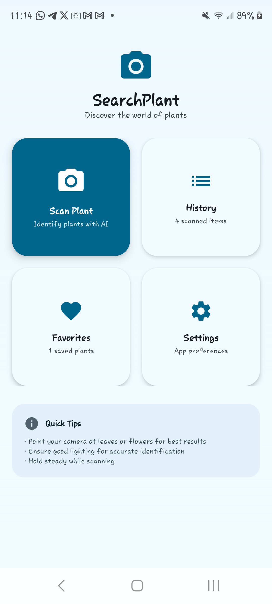
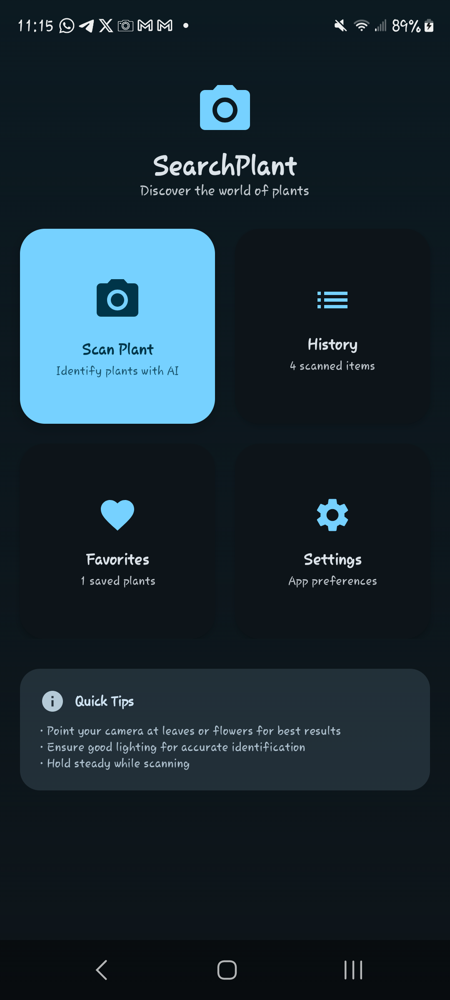
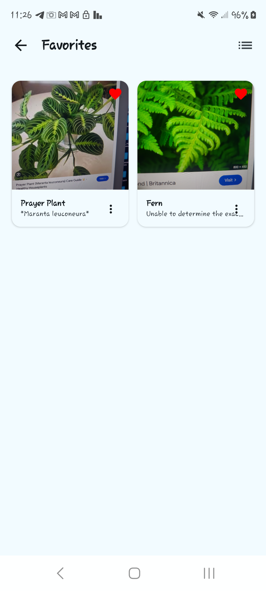
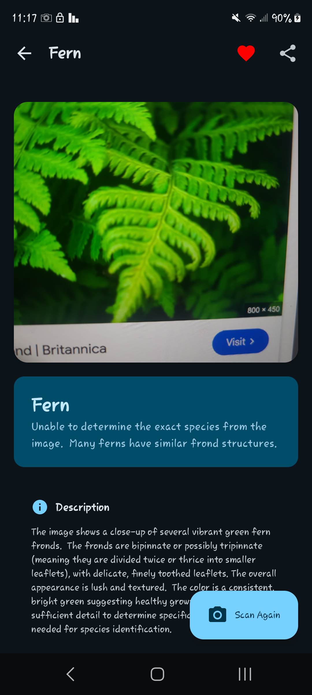

# SearchPlant 🌱

A modern Android plant scanner app that uses AI to identify plants and provide detailed information about them. Built with Jetpack Compose, CameraX, and Google Gemini AI.

## Features

### 🔍 Smart Plant Scanner
- Real-time camera preview with CameraX
- AI-powered plant identification using Google Gemini API
- High accuracy plant recognition with confidence scores
- Detailed plant information including scientific names, descriptions, and medicinal uses

### 📚 Scan History
- Local storage of all scanned plants using Room database
- Search functionality to find previously scanned plants
- Organized by categories and timestamps
- Offline access to scan history

### ⭐ Favorites System
- Mark plants as favorites for quick access
- Grid and list view options for favorites
- Easy toggle between favorite and regular items

### 🎨 Modern UI/UX
- Nature-inspired color scheme with earth tones
- Material Design 3 components
- Smooth animations and transitions
- Dark mode support
- Responsive design for different screen sizes

## Screenshots

<div align="center">

### Home Screen
| Light Mode                                    | Dark Mode                                       |
|-----------------------------------------------|-------------------------------------------------|
|  |      |


### Favorite and Scanned Result
| Favorite                                     | Scanned Result                                  |
|----------------------------------------------|-------------------------------------------------|
|  |  |

</div>

## Tech Stack

- **Language**: Kotlin
- **UI Framework**: Jetpack Compose
- **Architecture**: MVVM (Model-View-ViewModel)
- **Camera**: CameraX
- **AI/ML**: Google Gemini API
- **Database**: Room (SQLite)
- **Networking**: Retrofit + OkHttp
- **Image Loading**: Coil
- **Navigation**: Navigation Compose
- **Dependency Injection**: Manual DI with Application class

## Project Structure

```
app/src/main/java/com/kottland/searchplant/
├── data/
│   ├── dao/                    # Room DAOs
│   ├── database/               # Database setup and converters
│   ├── model/                  # Data models
│   └── repository/             # Repository pattern implementation
├── network/                    # API services
├── presentation/
│   ├── components/             # Reusable UI components
│   ├── navigation/             # Navigation setup
│   ├── screens/                # Screen composables
│   └── viewmodel/              # ViewModels
├── ui/theme/                   # Theme, colors, typography
├── utils/                      # Utility classes
├── MainActivity.kt             # Main activity
└── SearchPlantApplication.kt   # Application class
```

## Setup Instructions

### Prerequisites
- Android Studio Hedgehog or later
- Android SDK 24+
- Google Gemini API key

### Installation

1. **Clone the repository**
   ```bash
   git clone https://github.com/yourusername/SearchPlant.git
   cd SearchPlant
   ```

2. **Get Gemini API Key**
   - Visit [Google AI Studio](https://makersuite.google.com/app/apikey)
   - Create a new API key
   - Copy the API key

3. **Configure API Key**
   - Open `local.properties` file in the project root
   - Add your API key:
     ```
     GEMINI_API_KEY=your_actual_api_key_here
     ```

4. **Build and Run**
   - Open the project in Android Studio
   - Sync the project
   - Run the app on a device or emulator

### GitHub Actions CI/CD Setup

This project includes automated builds and releases via GitHub Actions.

#### Basic Build (No Secrets Required)
The workflow can build APKs without any configuration:
- Builds debug and release APKs automatically
- Uses dummy API key for compilation
- APKs are unsigned but functional for testing
- Perfect for contributors and forks

#### Full Release Setup (Optional)
For signed releases with real API functionality:

1. **Optional Secrets** (Go to Settings > Secrets and variables > Actions):
   - `GEMINI_API_KEY`: Your Google Gemini API key (for AI functionality)
   - `SIGNING_KEY`: Base64 encoded Android signing keystore (for signed APKs)
   - `ALIAS`: Keystore alias name
   - `KEY_STORE_PASSWORD`: Keystore password
   - `KEY_PASSWORD`: Key password

2. **Automatic Releases**:
   - Every push to `main` branch triggers a build
   - Creates releases only in original repository (not forks)
   - Release tags follow format: `vYYYY-MM-DD-{commit-hash}`
   - APK signing occurs only when signing secrets are available

### Permissions Required

The app requires the following permissions:
- `CAMERA` - For taking photos of plants
- `INTERNET` - For API calls to Gemini
- `ACCESS_NETWORK_STATE` - For checking network connectivity
- `READ_MEDIA_IMAGES` - For accessing saved images

## App Screens

### 🏠 Home Screen
- Camera preview with real-time feed
- Capture button for taking plant photos
- Navigation to History, Favorites, and Settings
- Permission handling for camera access

### 📊 Scan Result Screen
- Displays identified plant information
- Shows plant image, name, scientific name
- Detailed description and medicinal uses
- Favorite toggle and confidence score

### 📖 History Screen
- List of all scanned plants
- Search functionality
- Sort by date, name, or category
- Quick access to plant details

### ⭐ Favorites Screen
- Grid and list view of favorite plants
- Quick unfavorite option
- Empty state with helpful message

### ⚙️ Settings Screen
- Dark mode toggle
- Cache management
- Privacy policy and app information
- Feedback and rating options

## Key Components

### Data Layer
- **ScannedItem**: Entity model for plant data
- **ScannedItemDao**: Database access object
- **PlantRepository**: Single source of truth for data
- **GeminiApiService**: API service for plant identification

### Presentation Layer
- **PlantScannerViewModel**: Manages UI state and business logic
- **SearchPlantNavigation**: Navigation setup
- **Theme System**: Custom colors and typography

### Utility Classes
- **CameraUtils**: Image processing and optimization
- **Converters**: Room type converters for complex data

## Contributing

1. Fork the repository
2. Create a feature branch (`git checkout -b feature/amazing-feature`)
3. Commit your changes (`git commit -m 'Add amazing feature'`)
4. Push to the branch (`git push origin feature/amazing-feature`)
5. Open a Pull Request

## License

This project is licensed under the MIT License - see the [LICENSE](LICENSE) file for details.

## Acknowledgments

- Google Gemini AI for plant identification
- Material Design team for design guidelines
- Android Jetpack team for modern Android development tools
- Open source community for various libraries used

## Support

If you encounter any issues or have questions:
1. Check the [Issues](https://github.com/yourusername/SearchPlant/issues) page
2. Create a new issue with detailed information
3. Contact the development team

---

**Happy Plant Scanning! 🌿**